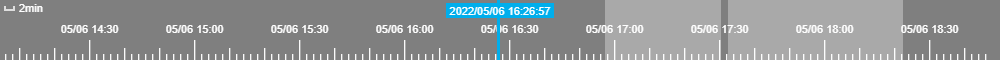

<!--
 * @Author: losting
 * @Date: 2022-05-07 15:31:25
 * @LastEditTime: 2022-05-15 11:14:12
 * @LastEditors: losting
 * @Description: 
 * @FilePath: \timeline\README.md
-->
# timeline
canvas 时间轴，支持缩放、拖拽、无限滚动


### 使用
``` shell
npm install @losting/timeline
```
``` html
<div id="root" style="width: 100%;height: 70px;">
  <canvas id="timeline"></canvas>
</div>
```

``` JavaScript
import Timeline from '@losting/timeline';

// new Timeline(canvasId, options)
const timeline = new Timeline('timeline', {
  fill: true,
});

timeline.draw({
  currentTime: 1651829532,
  areas: [{
    startTime: 1651827433,
    endTime: 1651829413,
    bgColor: '#00AEEC55'
  },{
    startTime: 1651829533,
    endTime: 1651832533,
    bgColor: '#00AEEC55'
  }],
});

timeline.on('timeUpdate', (time) => {
  console.log('selected time:', time);
})
```

### TimeLine options
| 属性 | 类型 | 默认值 | 说明 |
| --- | --- | --- | --- |
| textColor | string | #ffffff | 文字颜色 |
| pointColor | string | #ffffff | 刻度颜色 |
| areaColor | string | #ffffff55 | 阴影区域背景颜色 |
| centerTimePointColor | string | #00aeec | 当前时间指针颜色 |
| centerTimePointWidth | number | 3 | 当前时间指针宽度 |
| spacing | number | 5 | 刻度间距 |
| fill | boolean | false | 是否适应父容器宽高 |


### 事件

| 方法名 | 说明 |
| --- | --- |
| draw | 生成时间轴，参数：object，返回值：无 |
| on | 事件监听。参数：timeUpdate, 返回值：当前指向时间 |

#### draw方法
| 参数 | 类型 | 是否必填 | 说明 |
| --- | --- | --- | --- |
| startTime | number | 是 | 时间轴起始时间 |
| endTime | number | 是 | 时间轴终止时间 |
| currentTime | number | 否 | 当前所在时间，默认为起始时间 |
| areas | array | 否 | 阴影区域 |

#### areas
| 参数 | 类型 | 是否必填 | 说明 |
| --- | --- | --- | --- |
| startTime | number | 是 | 阴影区域开始时间 |
| endTime | number | 是 | 阴影区域结束时间点 |
| bgColor | string | 否 | 背景颜色, 默认值：#ffffff55 |

